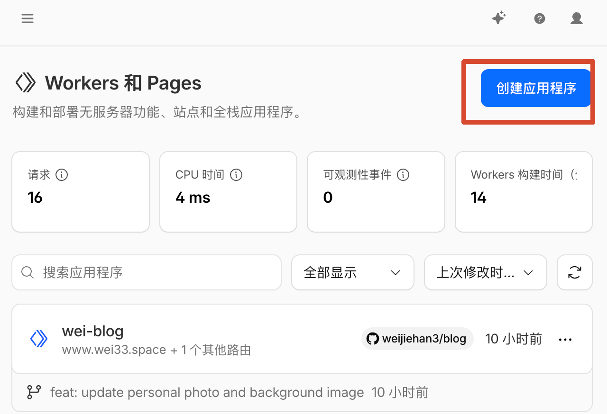
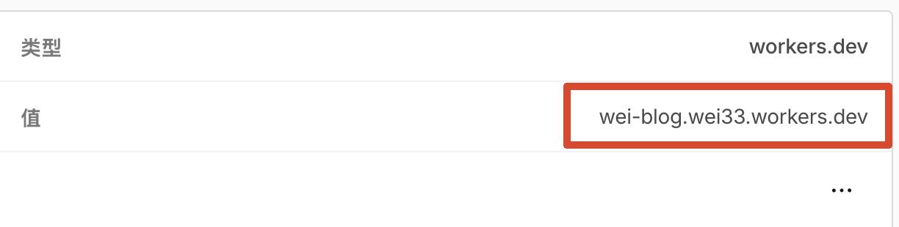

> [!abstract] 写在前面
> 为什么想部署个人博客呢？可能是因为obsidian的移动端体验太差，也可能就是单纯的想折腾一下，总之呢，就是想拥有一个属于自己的"狗窝"来记录一下自己的想法或者随笔吧。

## Astro模板选择以及本地部署

关于Astro模板的选择，我选择的是[Firefly](https://firefly.cuteleaf.cn/)，当然也可以去官方[Astro模板市场](https://astro.build/themes/)去选择自己喜欢的模板。

将模板项目拉取到本地后，首先可以在本地进行预览，确保模板符合预期，这里以Firefly模板为例，在终端中依次运行：

```shell
# 如果没有安装 pnpm，先安装
npm install -g pnpm

# 安装项目依赖
pnpm install

# 运行
pnpm dev
```

运行成功后，就可以在浏览器中访问本地的博客了，默认端口是4321。

## cloudflare部署

当然，仅仅只是在自己本地部署无法让别人看到自己独特的见解（折腾），所以需要将博客部署到云服务器上。这里我选择的是cloudflare workers。

### Cloudflare 连接 GitHub 仓库

我们首先要在自己本地部署的项目中，配置`wrangler.toml`文件，然后将自己的项目上传到GitHub。

```toml
name = "wei-blog"
compatibility_date = "2026-03-31" # 更为今日

[assets]
directory = "./dist"

[vars]
NODE_VERSION = "22"
```

进入 Cloudflare Dashboard → Workers & Pages，创建或打开你的 Worker 项目，然后连接 GitHub 仓库。

这里有一个很重要的细节：如果你连接的是一个已有 Worker，Cloudflare Dashboard 里的 Worker 名称必须和我们之前创建的 `wrangler.toml` 配置文件里的 `name` 一致，否则构建会失败。



随后，我们的将构建设置改为以下，并进行Deploy。

- Build command: `pnpm build`
- Deploy command: `npx wrangler deploy`

在部署成果以后，可以先确认 Cloudflare 分配的域名 `*.workers.dev` 是否可以正常访问博客。也就是说，部署完成后，你应该先验证：

```
https://你的worker名.你的subdomain.workers.dev
```



### 绑定自定义域名

当 `workers.dev` 能正常访问博客后，可以将自己的域名托管到 Cloudflare。这里我用的是 **Spaceship** 购买的域名.

1. 在 Cloudflare 添加站点

   先在 Cloudflare 中的管理域里把自己的域名加进去。加完后，Cloudflare 会给你分配两条 nameserver，例如：

   - `felipe.ns.cloudflare.com`
   - `kay.ns.cloudflare.com`

   只有当域名真正切到这对 nameserver 后，Cloudflare 才会把该域名的状态变成可用。

2. 到 Spaceship 修改 nameserver

   进入 Spaceship 的域名管理后台，找到 Advanced DNS，然后把 nameserver 改为 Custom nameservers，填入 Cloudflare 分配给你的那两条 nameserver。

   Spaceship 官方知识库提供的流程就是：进入域名 DNS 管理，选择自定义 nameserver，填入第三方 DNS 服务商给出的 nameserver，然后保存。

3. 等待传播并验证

   刚改完 nameserver，Cloudflare 页面常常会显示类似：

   - 名称服务器无效
   - 正在等待注册机构传播新的名称服务器

   这通常只是因为 nameserver 变更还在传播，传播完毕后会收到 CF 的邮件，或者我们也可以通过在终端中执行以下命令来判断是否验证成功：

   ```bash
   dig NS 你的域名
   ```

   如果结果已经变成 Cloudflare 分配给你的那两条 nameserver，就说明域名委派基本已经切换成功。这个时候 Cloudflare 后台通常也会很快变成可用状态。

4. 把域名绑定到 Worker

   成功托管后，需要让 Cloudflare 知道这个域名是属于你的，所以需要把域名绑定到 Worker。

   Cloudflare Dashboard → Workers & Pages → 你的 Worker → Settings → Domains & Routes → Add Custom Domain

   然后输入想要绑定的域名，例如：

   ```
   www.wei33.space
   ```

   Cloudflare 会自动创建相应记录，并为这个域名签发证书。

当完成以上步骤后，就可以通过 `www.wei33.space` 访问个人博客了。
